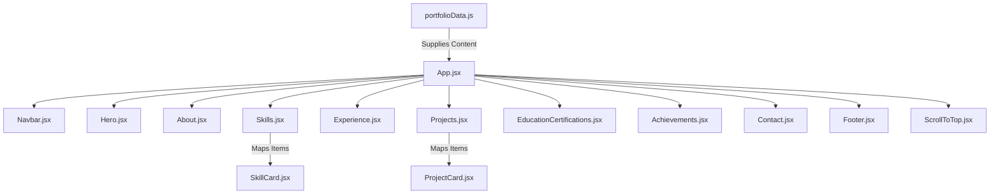

# 🚀 Rajesh Koneru - Developer Portfolio

A premium, interactive, and highly responsive developer portfolio showcasing backend and full-stack capabilities. Built using **React 19**, **Vite**, and **Tailwind CSS v4** with a sleek design, light/dark mode support, smooth animations, and centralized data management.

---

## 🧭 Interactive Navigation

Jump directly to any section of the documentation:

*   [🛠️ Tech Stack & Badges](#-tech-stack--badges)
*   [✨ Key Features](#-key-features)
*   [📊 Architecture & Component Tree](#-architecture--component-tree)
*   [📁 Project Directory Explorer (Interactive)](#-project-directory-explorer-interactive)
*   [🎨 Design System & Theme Tokens (Interactive)](#-design-system--theme-tokens-interactive)
*   [⚙️ Development & Build Workflows (Interactive)](#-development--build-workflows-interactive)
*   [✍️ Modifying Portfolio Content (Interactive)](#️-modifying-portfolio-content-interactive)

---

## 🛠️ Tech Stack & Badges

### Core Technologies


### Architecture & Tools


---

## ✨ Key Features

- [x] **Dual Theme Support**: Interactive light and dark modes with system preference fallback and localStorage persistence.
- [x] **Scroll Progress Tracker**: A dynamic bar at the top of the viewport indicating how far down the page the user has scrolled.
- [x] **Responsive Layout**: Designed mobile-first and optimized for desktops, tablets, and phones.
- [x] **Clean UI Animations**: Subtle micro-interactions, reveal-on-scroll animations, interactive buttons, and hover transitions.
- [x] **Centralized Data**: Single configuration file (`portfolioData.js`) that populates the entire portfolio, making updates fast and seamless.
- [x] **Professional Presentation**: Tailored for recruiters, highlighting backend expertise (Spring Boot, Flask, Django, SQL) alongside React.

---

## 📊 Architecture & Component Tree

The portfolio is structured with modular React components fed by a single centralized source of truth:



---

## 📁 Project Directory Explorer (Interactive)

<details>
<summary><b>🔍 Expand to Explore Directory Structure & File Roles</b></summary>
<br>

Below is the file structure layout of the portfolio project:

```text
Portofolio/
├── public/                       # Static files
│   ├── Rajesh_Koneru_Resume.pdf  # Recruiter-friendly resume download
│   ├── favicon.svg               # Browser favicon
│   └── icons.svg                 # Project SVG icons
├── src/                          # Application source code
│   ├── assets/                   # Images and local binary assets
│   │   ├── hero.png              # Hero header illustration
│   │   ├── react.svg
│   │   └── vite.svg
│   ├── components/               # Modular UI Components
│   │   ├── About.jsx             # Bio section & ECE strength cards
│   │   ├── Achievements.jsx      # Metrics of achievements (Mentored, solved DSA, etc.)
│   │   ├── Contact.jsx           # Form and professional email/phone channels
│   │   ├── EducationCertifications.jsx # School credentials and courses
│   │   ├── Experience.jsx        # Interactive timeline of jobs/internships
│   │   ├── Footer.jsx            # Copyright, design credits, social icons
│   │   ├── Hero.jsx              # Typing banner and download button
│   │   ├── Navbar.jsx            # Dynamic links, theme toggler, mobile drawer
│   │   ├── ProjectCard.jsx       # Single project tech stack & highlights component
│   │   ├── Projects.jsx          # Projects grid container
│   │   ├── ScrollToTop.jsx       # Floating back-to-top button
│   │   ├── SectionTitle.jsx      # Reusable section title and description layout
│   │   ├── SkillCard.jsx         # Proficiency category card with animated progress bars
│   │   └── Skills.jsx            # Skills grid container
│   ├── data/                     # Data Stores
│   │   ├── portfolioData.js      # Core profile JSON (Modify this to change text)
│   │   └── Rajesh_Resume_1.pdf   # Fallback resume resource
│   ├── App.css                   # Custom global React App styles
│   ├── App.jsx                   # Component entry orchestrator
│   ├── index.css                 # CSS Variables, Tailwind v4 imports, keyframes
│   └── main.jsx                  # React DOM render entry point
├── eslint.config.js              # ESLint configuration
├── index.html                    # HTML entry point (Meta tags & SEO headers)
├── package.json                  # Application metadata and dependencies
└── vite.config.js                # Vite build and plugin setup
```

</details>

---

## 🎨 Design System & Theme Tokens (Interactive)

<details>
<summary><b>🎨 Expand to View Design Tokens (Tailwind v4 & CSS Variables)</b></summary>
<br>

The application uses custom Tailwind v4 theme extensions inside `index.css` mapped to CSS variables for dynamic light/dark theme swapping.

| CSS Variable | Light Mode | Dark Mode | Mapping Description |
| :--- | :--- | :--- | :--- |
| `--bg-primary` | `#f8fafc` (slate-50) | `#080c18` (midnight) | Core website background |
| `--bg-secondary` | `#ffffff` (white) | `#0e1628` (slate-900) | Card and container background |
| `--text-primary` | `#0f172a` (slate-900) | `#f1f5f9` (slate-100) | Dominant text headings |
| `--text-secondary`| `#475569` (slate-600) | `#94a3b8` (slate-400) | Supporting bio/details text |
| `--accent` | `#2563eb` (blue-600) | `#38bdf8` (sky-400) | Theme highlights, progress, triggers |
| `--border-color` | `#e2e8f0` (slate-200) | `#1e293b` (slate-800) | Dividers and card borders |
| `--glow` | `rgba(37, 99, 235, 0.05)` | `rgba(56, 189, 248, 0.1)` | Neon card drop shadow |

### Font Typography
- **Heading Font**: `Outfit` (Modern, geometric sans-serif)
- **Body Font**: `Inter` (Highly readable, neutral sans-serif)
- **Monospace Font**: `Fira Code` (Used for tech stack tag labels and date badges)

</details>

---

## ⚙️ Development & Build Workflows (Interactive)

<details>
<summary><b>💻 Expand to View Local Execution & Setup Commands</b></summary>
<br>

### Prerequisites
Make sure you have [Node.js](https://nodejs.org/) installed (LTS version recommended).

### 🖥️ Local Terminal Instructions

Follow these commands in your shell to get started:

```bash
# 1. Clone the repository (if not already local)
git clone https://github.com/Rajesh-koneru/Portofolio_website.git
cd Portofolio_website

# 2. Install package dependencies
npm install

# 3. Spin up the Vite development server (includes Hot Module Replacement)
npm run dev
```

The app will start running locally at: **`http://localhost:5173`**

### Production Build

To compile and optimize the website for hosting (Vercel, Netlify, GitHub Pages, or AWS S3):

```bash
# Compile and build assets into /dist directory
npm run build

# Preview the built production files locally
npm run preview
```

### Formatting and Linting

Keep the codebase clean and error-free:

```bash
# Run ESLint validation checks
npm run lint
```

</details>

---

## ✍️ Modifying Portfolio Content (Interactive)

<details>
<summary><b>✏️ Expand to View Profile Update Guide</b></summary>
<br>

All portfolio content is decoupled from components. To modify what is shown on the live portfolio website, open the file [portfolioData.js](file:///c:/Users/user/SpringBoot_apps/Portofolio/src/data/portfolioData.js).

### Data Schema Structure

```javascript
export const portfolioData = {
  personalInfo: {
    name: "Rajesh Koneru",
    headline: "Backend Developer | Full-Stack Developer",
    location: "Hyderabad, Telangana, India",
    email: "rajeshkoneru29@gmail.com",
    phone: "+91 9390193971",
    linkedin: "https://linkedin.com/in/rajesh-koneru",
    github: "https://github.com/rajesh-koneru",
    summary: "...", // Bio description
  },
  roles: [ ... ], // Strings that rotate/display in the Hero title
  skills: [
    {
      category: "Programming Languages",
      items: [
        { name: "Python", level: 90 }, // Skill tag with percentage bar strength
        { name: "Java", level: 85 }
      ]
    }
  ],
  experience: [ ... ], // Internships and jobs
  projects: [ ... ],   // Projects with highlights list & tech tags
  education: { ... },  // Educational degree & CGPA details
  certifications: [ ... ], // Certifications and badges
  achievements: [ ... ]    // Stat counters (Mentored 20+, etc.)
};
```

Simply update this JSON structure, and React will automatically re-render the sections with the updated details.

</details>

---

*Built with ❤️ by [Rajesh Koneru](https://github.com/Rajesh-koneru)*
